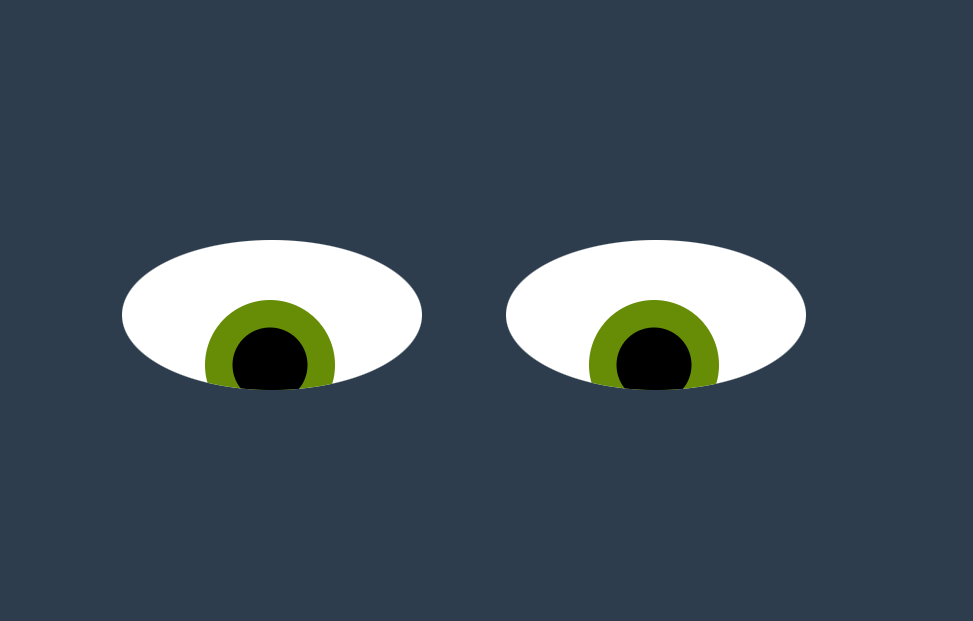

# Eye Movement
This program allows the user to track mouse movements using a set of eyes. 
## How to Run:
Download all of the files onto your computer. Drag the index.html file into your browser. As you move your mouse across the screen, the eyes will track your movements.

## Future Improvements:
Add an entire face; add details like eye brows and eye lashes; add a different function for clicks (e.g. eyes blink or wink)

